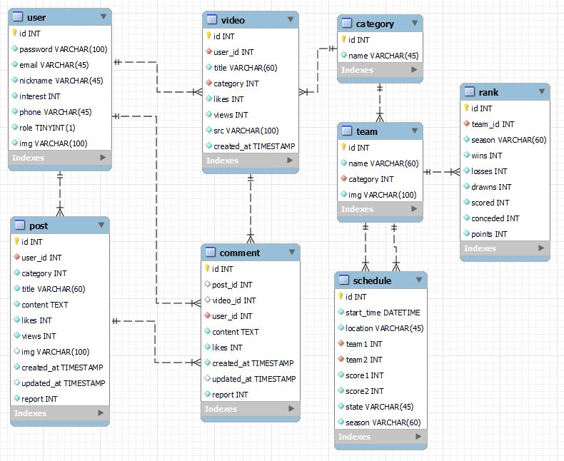
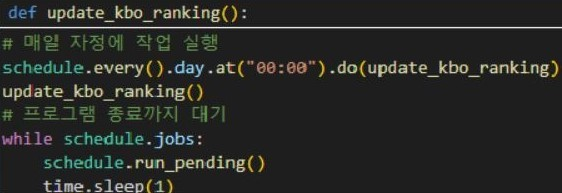
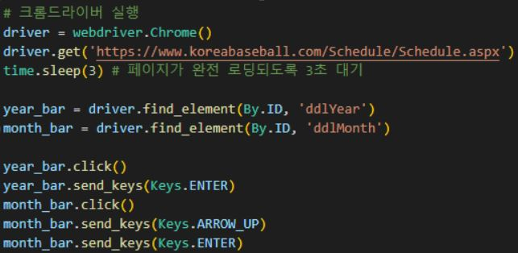
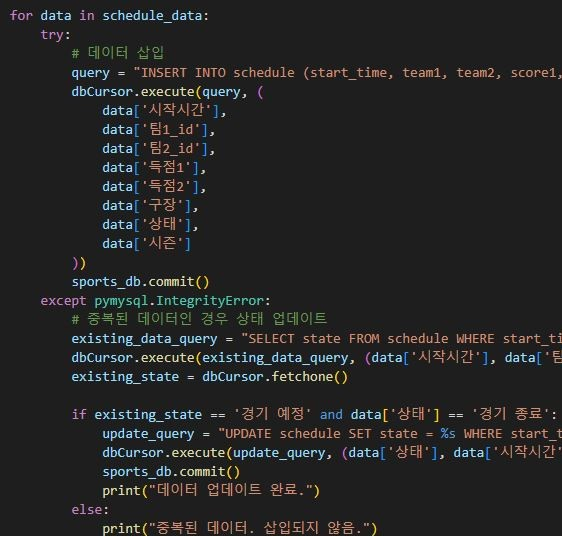
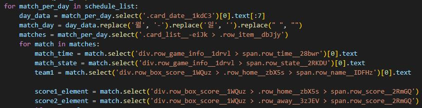

# 스포츠 커뮤니티 FANHANA

## 개요
국내 스포츠(K-League, KBO, LCK) 정보 및 커뮤니티 사이트

### 만든 목적
- 국내 주요 스포츠들의 팀과 경기 정보들을 확인하고 의견을 주고 받을 수 있는 온라인 팬커뮤니티 사이트 제공
- 매일 반영되는 팀순위와 시즌별 팀 정보, 그리고 경기가 열리는 장소에 대한 지도앱 정보 제공

### 일정
- 23.5 ~ 23.6

### 담당
- 데이터베이스 설계 및 데이터 관리, API명세 및 코드작성, 스포츠 데이터 크롤링 수집 및 정제, 백엔드 서버 배포


## 사용 스택 및 환경
- 서버) 가상 머신 환경: VirtualBox 6.1.22, Ubuntu 20.04 LTS
- 웹 서버: nginx 1.18.0
- 백엔드 프레임워크: Express 4.17.1
- 프로세스 관리 도구: pm2 5.1.0
- 데이터베이스: MySQL 8.0.23
- 언어: TypeScript 4.6, Python 3.11
- 런타임 환경: Node.js 14.17.0

## 내용

### ERD
- 
  - 웹이 각종 스포츠 커뮤니티라는 특성을 고려해 MySQL을 선택. 인덱싱 기능과 쿼리 최적화를 통해 빠른 데이터 접근과 처리가 가능하며, 트랜젝션 처리와 ACID 속성을 지원해 데이터 무결성을 보장할 수 있어서 mongodb와는 다른 장점. 
  - 데이터 무결성을 강화하기 위해 유저가 계정을 삭제한 경우에는 관련된 게시글과 댓글 등 모든 관련 데이터가 삭제되도록 외래키를 CASCADE로 설정. 비슷한 다른 외래키들 역시 이렇게 함으로써 데이터의 일관성을 유지하고 불필요한 데이터의 남겨짐을 방지.

### 크롤링
- 
  - 데이터의 신뢰성과 정확성을 강화하기 위해 이 작업을 매일 자정 혹은 주기적으로 스케줄링하여 자동으로 수행하도록 설정
- 
  - 동적으로 변하는 웹 요소들은 셀레니움과 웹 드라이버를 활용하여 직접 웹을 제어하여 데이터를 수집
- 
  - 크롤링한 정보는 pymysql을 통해 데이터베이스와 연동하여 저장
- 
  - 크롤링한 정보를 API에 맞게 재가공하여 DB에 전송

***

### RESTful API
- user.router.ts 중 일부
  - JWT 토큰의 유효성을 검사하여 사용자가 로그인되었는지를 판단하고 라우터는 그 요청을 컨트롤러에 전달
```
import * as userController from '../controller/user.controller';
import { isAccessTokenValid } from '../middleware/jwt';
export const userRoute = express();

// 로그인 필요
// 유저 정보 조회
userRoute.get('/', isAccessTokenValid, userController.getUserInfo);
```


- user.controller.ts 중 일부
  - 컨트롤러는 API별 받은 요청을 처리하기 위해 받은 데이터를 검사하여 에러처리를 하며 서비스로 비즈니스 로직 위임
```
// 유저 정보 수정
export const updateUserHandler = async (req: Request, res: Response, next: NextFunction) => {
  const userId = req.user.user_id;

  try {
    const { nickname, phone, interest, img } = req.body;

    if (!nickname && !phone && !interest && !img) throw new AppError(400, '변경된 값이 없습니다!');

    const updateUserData: User.updateUserInput = {
      nickname,
      phone,
      interest,
      img,
    };

    const userInfo = await userService.updateUserInfo(userId, updateUserData);

    res.status(201).json({ message: '유저 수정 성공', data: userInfo });
  } catch (error: any) {
    console.log('유저 수정 실패');
    throw error;
  }
};
```


- user.service.ts 중 일부
  - 서비스는 받은 데이터를 이용해 데이터 정합성 체크 및 API 관련 로직 처리
  - DB 관련 작업은 repo을 호출하여 상호적으로 처리
  - 최종적으로 클라이언트의 요청 결과를 return
```
// 유저 정보 수정
export const updateUserInfo = async (
  userId: number,
  updateData: updateUserInput
): Promise<UserProfile> => {
  try {
    const foundUser = await userRepo.getUserInfoById(userId);
    if (!foundUser.id) throw new AppError(404, '존재하지 않는 아이디 입니다.');

    // 카테고리 유효성 검사
    const categories = await categoryRepo.getCategoriesInfo();

    if (updateData.interest) {
      const categoryExists = categories.some(
        (category) => category.id === Number(updateData.interest)
      );
      if (!categoryExists) {
        throw new AppError(400, '유효하지 않은 카테고리입니다.');
      }
    }

    const updateUser = await userRepo.updateUser(userId, updateData);
    const user = await userRepo.getUserInfoById(updateUser.id);
    return user;
  } catch (error) {
    console.error(error);
    throw new Error('[유저 수정 에러] 유저 정보 수정에 실패했습니다.');
  }
};
```


- user.repo.ts 중 일부
  - repo는 DB를 통해 데이터를 읽거나 저장하며 작업을 수행해 결과를 서비스로 반환
```
// 유저 정보 수정
export const updateUser = async (userId: number, updates: Partial<UserInfo>): Promise<UserInfo> => {
  try {
    const updateValues = Object.entries(updates)
      .map(([key, value]) => {
        if (typeof value === 'string') {
          return `${key} = '${value}'`;
        }
        return `${key} = ${value}`;
      })
      .join(', ');

    await db.query(
      `
      UPDATE user
      SET ${updateValues}
      WHERE id = ?
      `,
      [userId]
    );

    const updatedUser = await getUserInfoById(userId);

    return updatedUser;
  } catch (error) {
    console.log(error);
    throw error;
  }
};
```

